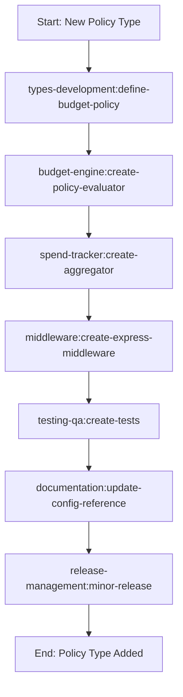
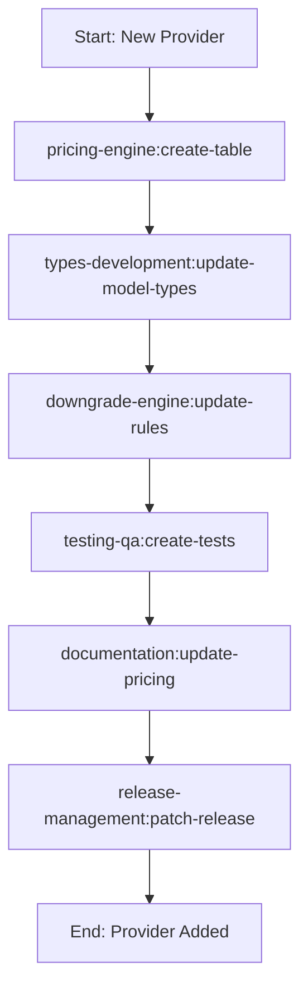
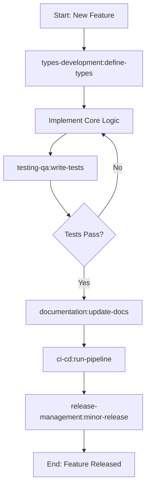
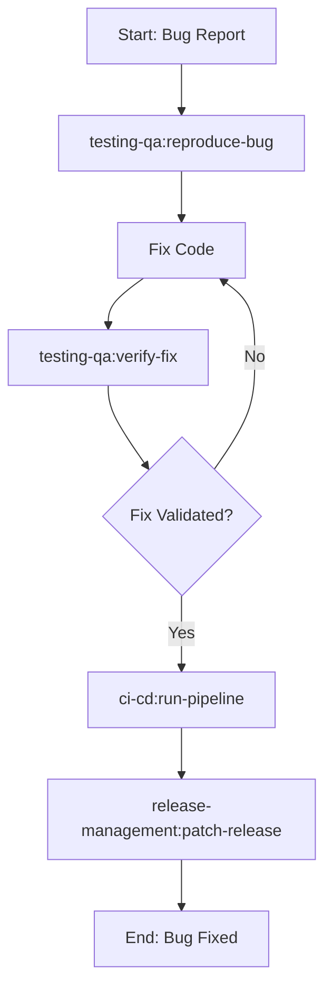

# Agent Skills: agent-budget-controller

## Overview

This document defines the agent skills and workflows for developing the `agent-budget-controller` project. Each skill represents a specialized capability that can be executed by AI agents or development tools to accomplish specific tasks within the project.

**Repository:** `github.com/reaatech/agent-budget-controller`
**GitHub User:** `reaatech`

## Agent Skills Directory Structure

```
skills/
├── project-setup/
│   └── skills.md          # Project initialization and setup skills
├── types-development/
│   └── skills.md          # Domain types and Zod schema development
├── pricing-engine/
│   └── skills.md          # Pricing table and lookup skills
├── spend-tracker/
│   └── skills.md          # Real-time spend tracking skills
├── budget-engine/
│   └── skills.md          # Budget enforcement engine skills
├── middleware/
│   └── skills.md          # Express/SDK middleware integration skills
├── otel-bridge/
│   └── skills.md          # OpenTelemetry cost exporter bridge skills
├── llm-router-plugin/
│   └── skills.md          # LLM Router integration skills
├── cli/
│   └── skills.md          # CLI command development skills
├── testing-qa/
│   └── skills.md          # Testing and quality assurance skills
├── documentation/
│   └── skills.md          # Documentation generation skills
├── ci-cd/
│   └── skills.md          # CI/CD pipeline skills
└── release-management/
    └── skills.md          # Release and versioning skills
```

## Available Agent Skills

### 1. Project Setup Skills (`skills/project-setup/skills.md`)

- Initialize pnpm workspace monorepo
- Configure TypeScript (strict, ES2022, NodeNext)
- Set up ESLint + Prettier + Husky + lint-staged
- Configure Vitest with coverage
- Create package.json for each workspace package
- Set up path aliases and tsconfig

### 2. Types Development Skills (`skills/types-development/skills.md`)

- Define BudgetScope enum and types
- Create BudgetPolicy interface with Zod schemas
- Define EnforcementAction and state machine types
- Build SpendEntry and BudgetState types
- Create DowngradeRule and ToolCostConfig types
- Define structured error types (BudgetError, BudgetExceededError, BudgetValidationError)
- Define scope resolver interfaces

### 3. Pricing Engine Skills (`skills/pricing-engine/skills.md`)

- Implement pricing table loader (Anthropic, OpenAI, Google, AWS Bedrock)
- Create ModelNormalizer for provider-specific model names
- Build PricingEngine with LRU cache
- Support file-based pricing overrides
- Implement price lookup with fallback chains

### 4. Spend Tracker Skills (`skills/spend-tracker/skills.md`)

- Build SpendStore with circular buffer (max 500K entries)
- Create multi-index structure (by scope, by time, by model)
- Implement SpendAggregator with sliding windows
- Add real-time spend rate calculation
- Build anomaly/spike detection
- Implement O(1) per-scope spend lookups

### 5. Budget Engine Skills (`skills/budget-engine/skills.md`)

- Implement BudgetController orchestrator
- Build PolicyEvaluator for soft/hard cap evaluation
- Create DowngradeEngine for model tier swapping
- Implement ToolFilter for expensive tool removal
- Build ThresholdMonitor with event emission
- Create per-scope state machine (active → warned → degraded → stopped)
- Implement budget reset scheduling (cron-based)

### 6. Middleware Skills (`skills/middleware/skills.md`)

- Create Express/Fastify middleware (pre-request + post-request hooks)
- Build BudgetInterceptor SDK wrapper for non-HTTP agents
- Implement scope resolver with multi-scope priority
- Add cost estimator integration
- Inject response headers (X-Budget-Remaining, X-Budget-Status, etc.)
- Handle model downgrade interception
- Implement tool filtering middleware

### 7. OTel Bridge Skills (`skills/otel-bridge/skills.md`)

- Consume metrics from @otel-cost-exporter/core
- Implement OTLP metric receiver (HTTP/gRPC)
- Build span listener that converts GenAI spans → SpendEntry
- Add real-time cost metric subscription
- Implement push-based and pull-based spend recording
- Handle reconnection and local buffering

### 8. LLM Router Plugin Skills (`skills/llm-router-plugin/skills.md`)

- Implement RoutingStrategy interface from llm-router
- Create budget-aware strategy (priority 1, above all others)
- Build budget-based model filtering
- Hook into llm-router fallback chains for auto-downgrade
- Export cost telemetry back to llm-router CostTracker
- Create YAML config section for llm-router.config.yaml

### 9. CLI Skills (`skills/cli/skills.md`)

- Implement `check` command (remaining budget for scope)
- Implement `list` command (all active budgets)
- Implement `report` command (spend breakdown, multiple formats)
- Implement `set` command (create/update budget)
- Implement `reset` command (manual budget reset)
- Implement `validate-config` command
- Implement `simulate` command (estimate if request fits budget)
- Use commander.js with typed options

### 10. Testing & QA Skills (`skills/testing-qa/skills.md`)

- Write unit tests with Vitest (90%+ coverage target)
- Create integration tests (spend tracker + budget engine + middleware)
- Build contract tests for otel-cost-exporter integration
- Build contract tests for llm-router integration
- Write performance tests (10K concurrent scope checks)
- Implement memory leak tests
- Create test fixtures and factories

### 11. Documentation Skills (`skills/documentation/skills.md`)

- Generate TSDoc API reference
- Create configuration reference guide
- Build integration examples (standalone, with otel-cost-exporter, with llm-router)
- Write README.md with quickstart
- Maintain ARCHITECTURE.md and DEV_PLAN.md
- Generate changelog entries

### 12. CI/CD Skills (`skills/ci-cd/skills.md`)

- Configure GitHub Actions workflows
- Set up automated build, test, lint, typecheck
- Implement security scanning (npm audit, dependency check)
- Configure coverage reporting
- Set up artifact publishing to npm
- Implement branch protection rules

### 13. Release Management Skills (`skills/release-management/skills.md`)

- Manage semantic versioning across packages
- Create release notes with changelog
- Publish to npm (scoped @agent-budget-controller)
- Update pricing tables
- Tag GitHub releases
- Handle breaking change documentation

## Using Agent Skills

### Skill Invocation Format

```bash
# Invoke a specific skill
agent invoke <skill-name> [parameters]

# Example: Initialize project
agent invoke project-setup:init --name agent-budget-controller

# Example: Add pricing table
agent invoke pricing-engine:add-provider --provider anthropic
```

### Skill Parameters

Each skill accepts parameters in JSON format:

```json
{
  "skill": "budget-engine:define-budget",
  "parameters": {
    "scopeType": "user",
    "scopeKey": "user-123",
    "limit": 10.0,
    "policy": {
      "softCap": 0.8,
      "hardCap": 1.0,
      "autoDowngrade": [{ "from": ["claude-opus-4-1"], "to": "claude-sonnet-4" }]
    }
  }
}
```

## Agent Workflows

### Workflow 1: New Budget Policy Type



### Workflow 2: New Provider Pricing



### Workflow 3: Feature Development



### Workflow 4: Bug Fix



## Skill Dependencies

```
project-setup
    ├── types-development
    ├── pricing-engine
    ├── spend-tracker
    ├── budget-engine
    ├── middleware
    ├── otel-bridge
    ├── llm-router-plugin
    ├── cli
    ├── testing-qa
    ├── documentation
    ├── ci-cd
    └── release-management

types-development → pricing-engine → spend-tracker → budget-engine → middleware → cli
                                                     ↘
                                                      otel-bridge
                                                      llm-router-plugin
```

## Configuration

### Agent Configuration File

```yaml
# .agentrc.yaml
version: '1'

agent:
  name: agent-budget-controller-dev
  github:
    user: reaatech
    repo: agent-budget-controller

  skills:
    enabled:
      - project-setup
      - types-development
      - pricing-engine
      - spend-tracker
      - budget-engine
      - middleware
      - otel-bridge
      - llm-router-plugin
      - cli
      - testing-qa
      - documentation
      - ci-cd
      - release-management

  defaults:
    typescript:
      strict: true
      target: ES2022
      module: NodeNext

    testing:
      coverage:
        threshold: 90
        lines: 90
        functions: 90
        branches: 85

    quality:
      eslint: error
      prettier: check
      typescript: strict

    monorepo:
      packageManager: pnpm
      nodeVersion: '22'
```

## Skill Execution Context

### Environment Variables

```bash
# GitHub Configuration
GITHUB_USER=reaatech
GITHUB_REPO=agent-budget-controller

# Development
NODE_ENV=development
PNPM_HOME=/usr/local/pnpm

# Testing
VITEST_COVERAGE=true
COVERAGE_THRESHOLD=90

# Release
NPM_TOKEN=${NPM_TOKEN}
GITHUB_TOKEN=${GITHUB_TOKEN}

# Integration Testing
OTEL_COST_EXPORTER_PATH=../otel-cost-exporter
LLM_ROUTER_PATH=../llm-router
```

## Skill Output Formats

### Success Response

```json
{
  "skill": "skill-name",
  "status": "success",
  "result": {
    "files_created": ["file1.ts", "file2.ts"],
    "files_modified": ["file3.ts"],
    "summary": "Skill completed successfully"
  },
  "timestamp": "2026-04-22T00:00:00.000Z"
}
```

### Error Response

```json
{
  "skill": "skill-name",
  "status": "error",
  "error": {
    "code": "SKILL_EXECUTION_FAILED",
    "message": "Detailed error message",
    "details": {}
  },
  "timestamp": "2026-04-22T00:00:00.000Z"
}
```

## Best Practices

### 1. Skill Design Principles

- **Single Responsibility** — Each skill does one thing well
- **Composability** — Skills can be combined into workflows
- **Idempotency** — Skills can be safely re-run
- **Testability** — Skills have clear inputs and outputs

### 2. Error Handling

- Always validate inputs before execution
- Provide clear error messages
- Roll back changes on failure
- Log all skill executions

### 3. Security

- Never commit secrets or tokens
- Validate all external inputs
- Use secure defaults
- Follow principle of least privilege

### 4. Integration Testing

- Test against real otel-cost-exporter package
- Test against real llm-router package
- Use sibling repo paths (../otel-cost-exporter, ../llm-router)
- Mock external LLM provider APIs

## Contributing New Skills

### Skill Template

````markdown
# Skill Name

## Description

Brief description of what this skill does.

## Parameters

- `param1` (required): Description
- `param2` (optional): Description

## Usage

```bash
agent invoke skill-name --param1 value1 --param2 value2
```
````

## Examples

```json
{
  "skill": "skill-name",
  "parameters": {
    "param1": "value1"
  }
}
```

## Output

Description of expected output.

## Dependencies

List of skills this skill depends on.

## Tests

How to test this skill.

```

## Maintenance

### Regular Tasks
- [ ] Review and update skills monthly
- [ ] Add new skills as needed
- [ ] Remove deprecated skills
- [ ] Update documentation
- [ ] Validate skill dependencies
- [ ] Update pricing tables for all providers

### Quality Metrics
- Skill success rate > 95%
- Average execution time < 30 seconds
- Test coverage > 90%
- Documentation completeness > 90%
- Budget check latency < 1ms (p99)

## Support

For questions or issues with agent skills:
- Check individual skill documentation
- Review workflow examples
- Consult this AGENTS.md file
- Open GitHub issue at `github.com/reaatech/agent-budget-controller`

---

*This document is maintained alongside the project and should be updated as new skills are added or existing skills are modified.*
```
